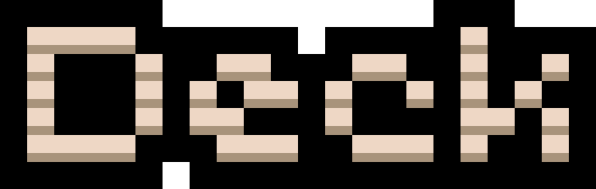


# Deck

Terminal-based presentations from Markdown files using PowerShell.


[](https://www.powershellgallery.com/packages/Deck)


## Quick Start

```powershell
Install-Module Deck -Scope CurrentUser
```

Or clone from GitHub:

```powershell
git clone https://github.com/jakehildreth/Deck.git
Import-Module ./Deck/Deck.psd1
```

Create a Markdown file:

```markdown
---
background: Black
foreground: Cyan1
border: Blue
---

# My Presentation

---

## Section Title

---

### Slide Content

Your content here with **bold** and *italic* text.

* Progressive bullets
* Reveal one at a time
```

Run the presentation:

```powershell
Show-Deck -Path ./presentation.md
```

Or load directly from a web URL:

```powershell
Show-Deck -Path https://raw.githubusercontent.com/jakehildreth/Deck/main/Examples/ExampleDeck.md
```

Validate content before presenting:

```powershell
Show-Deck -Path ./presentation.md -Strict
```

The `-Strict` parameter validates:
- Content height doesn't exceed viewport
- Image files exist
- Reports all errors before starting

## Features

### Slide Types

* Title Slides - Single `#` heading with large figlet text  
* Section Slides - Single `##` heading with medium figlet text  
* Content Slides - `###` heading with body content  
* Image Slides - Two-panel layout with content left (60%), image right (40%)  
* Multi-Column Slides - Split content with `|||` delimiter  
* Table Slides - Markdown tables rendered as Spectre.Console tables  
* Syntax Highlighting - Fenced code blocks with language-aware highlighting via TextMate

#### Image Slides

Create side-by-side layouts with text and images:

```markdown
### Slide Title

Text content on the left.

* Progressive bullets supported
* Auto-sized images

{width=80}
```

Images are auto-detected. Use relative or absolute paths. Optional `{width=N}` sets max width.

Web images are supported:

```markdown

### About Our Brand
Content appears here
```

#### Tables

Markdown tables render as rounded Spectre.Console tables:

```markdown
### Slide Title

| Name   | Role       | Status |
|-------|----------|-------|
| Alice  | Engineer   | Active |
| Bob    | Designer   | Active |
```

Tables work on content slides, image slides, and multi-column slides.

#### Syntax Highlighting

Fenced code blocks with a language identifier get automatic syntax highlighting powered by [TextMate](https://github.com/nicknisi/TextMate):

````markdown
```powershell
Get-Process | Where-Object CPU -gt 100
```
````

Renders in a rounded panel with language header and full color tokenization. Supports 60+ languages including PowerShell, Python, C#, JavaScript, Rust, Go, SQL, YAML, and more. Falls back to plain monochrome when a language grammar isn't available.

### Bullet Points

* Progressive bullets using `*` (reveal one at a time)  
* Static bullets using `-` (all visible at once)

### Inline Formatting

* `**bold**` or `__bold__`  
* `*italic*` or `_italic_`  
* `` `code` ``  
* `~~strikethrough~~`
* `<colorname>text</colorname>` or `<span style="color:colorname">text</span>` for colors

#### Color Examples

```markdown
This text has <red>red</red>, <blue>blue</blue>, and <green>green</green> colors.

You can use standard HTML: <span style="color:yellow">yellow text</span>

Mix with formatting: **<red>bold red text</red>** or *<blue>italic blue</blue>*
```

Supports all [Spectre.Console color names](https://spectreconsole.net/appendix/colors).

### Navigation

* Forward: Right, Down, Space, Enter, `n`, Page Down  
* Backward: Left, Up, Backspace, `p`, Page Up  
* Exit: Esc, Ctrl+C, `q`  
* Help: `?`

### Customization

Configure in YAML frontmatter:

```yaml
---
background: black          # Background color
foreground: white          # Text color
border: magenta            # Border color
borderStyle: rounded       # rounded, square, double, heavy, none
pagination: false          # Show slide numbers
paginationStyle: minimal   # minimal, fraction, text, progress, dots
h1: default                # Figlet font for # titles (aliases: titleFont, h1Font)
h2: default                # Figlet font for ## sections (aliases: sectionFont, h2Font)
h3: default                # Figlet font for ### headers (aliases: headerFont, h3Font)
h1Color: null              # Color for # titles (aliases: titleColor, h1FontColor)
h2Color: null              # Color for ## sections (aliases: sectionColor, h2FontColor)
h3Color: null              # Color for ### headers (aliases: headerColor, h3FontColor)
---
```

#### Heading Colors

Heading colors can be specified three ways:

1. **Inline HTML tags** (highest priority):
```markdown
# <red>Red Title</red>
## <cyan>Cyan Section</cyan>
### <green>Green Header</green>
```

2. **Frontmatter settings**:
```yaml
h1Color: red
h2Color: cyan
h3Color: green
```

3. **Foreground fallback** (if neither above is specified)

Both `<colorname>text</colorname>` and `<span style="color:colorname">text</span>` syntax are supported.

## Examples

See [Examples/ExampleDeck.md](Examples/ExampleDeck.md) for a comprehensive demo:

```powershell
Show-Deck -Path ./Examples/ExampleDeck.md
```

Additional examples in `Examples/Features/`:
- [ColorTest.md](Examples/Features/ColorTest.md) - Inline color text examples
- [HeadingColorsTest.md](Examples/Features/HeadingColorsTest.md) - Heading color examples
- [ImageTest.md](Examples/Features/ImageTest.md) - Image slide layouts
- [MultiColumnTest.md](Examples/Features/MultiColumnTest.md) - Multi-column layouts
- [BulletTest.md](Examples/Features/BulletTest.md) - Bullet reveal behavior
- [TitleTest.md](Examples/Features/TitleTest.md) - Title and section slides
- [TableTest.md](Examples/Features/TableTest.md) - Markdown table rendering
- [SyntaxHighlightTest.md](Examples/Features/SyntaxHighlightTest.md) - Code block syntax highlighting

## Requirements

- PowerShell 7.4 or later
- [TextMate](https://github.com/trackd/TextMate) (auto-installed if missing)
- macOS arm64 only — x64 (Intel) macOS is not supported

## License

MIT License w/Commons Clause - see [LICENSE](LICENSE) file for details.

## Built With

- PowerShell
- [TextMate](https://github.com/trackd/TextMate)

Made with 💜 by [Jake Hildreth](https://jakehildreth.com)

